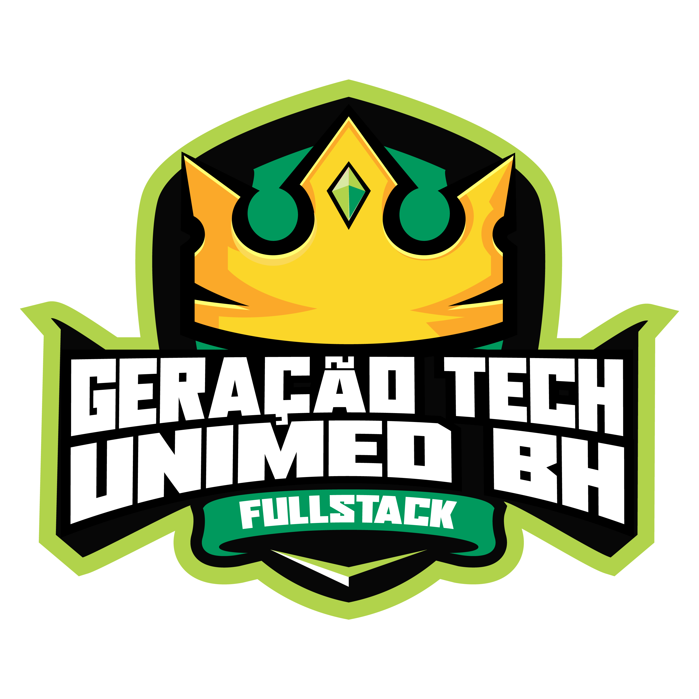

 <h1 align="center"> Geração Tech Unimed-BH | Fullstack </h1>

 <h1 align="center">

 
 
 
 
 
 </h1> 

O Programa Geração Tech Unimed-BH é um programa que oferece bootcamps gratuitos. Nesta primeira edição, o bootcamp ofertado formará novos desenvolvedores fullstack nas tecnologias Javascript, MySQL, Angular e .NET. Durante o bootcamp, você irá desenvolver projetos práticos, participar de mentorias ao vivo e exclusivas, obter seu certificado e ainda complementar seu portfólio. Ao final do programa, a Unimed-BH espera contratar os melhores perfis para atuar na região de Belo Horizonte.

> Finalize todos conteúdos até a data 24/07/2022 e certifique seu conhecimento.

## Mentorias

- ### Mentoria #1: Carreiras Tech na Unimed BH 
    :arrow_forward: [Live](https://www.youtube.com/watch?v=ldidc6CZ_dU)
    :date: 30/05/2022 :clock2: 14:00 :hourglass: 2 horas
    :man_teacher: Paulo Henrique Amorim Rodrigues :department_store: unimed
    :man_teacher: Cesar Magdalena :department_store: unimed
    :man_teacher: Rafael Paolinelli :department_store: unimed
    

## Atividades | Cursos

- [:heavy_check_mark:] Módulo 0 - Prepare-se para a Jornada
    - [:heavy_check_mark:] Conheça as Oportunidades da DIO
    - [:heavy_check_mark:] Seja Protagonista Neste Bootcamp
    - [:heavy_check_mark:] Boas-vindas ao Bootcamp: Geração Tech Unimed BH | Fullstack
    - [:heavy_check_mark:] Aula Inaugural - Geração Tech Unimed-BH | Fullstack
- [:heavy_check_mark:] Módulo I - Princípios de Desenvolvimento de Software
    - [:heavy_check_mark:] Introdução à Programação e Pensamento Computacional
    - [:heavy_check_mark:] Introdução ao Git e ao GitHub
    - [:heavy_check_mark:] Criando seu Primeiro Repositório no GitHub Para Compartilhar Seu Progresso
- [ ] Módulo II - Fundamentos Web com HTML e CSS
    - [] Primeiros passos para desenvolvimento web
    - [] Introdução a criação de websites com HTML5 e CSS3
    - [] Posicionando elementos com Flexbox em CSS
    - [] Posicionando elementos com Flexbox em CSS
- [ ] Módulo III - Conhecendo a Linguagem de Programação JavaScript
    - [] Introdução ao JavaScript
    - [] Sintaxe e Operadores
    - [] Sintaxe Básica em JavaScript
    - [] Variáveis e Tipos
    - [] Trabalhando com Módulos em JavaScript
    - [] Funções
    - [] Introdução ao TypeScript: Explorando Classes, Tipos e Interfaces
    - [] Desafios Iniciais Js - Unimed BH
    - [] Introdução Prática ao TypeScript
- [ ] Módulo IV - Desenvolvimento Web com Angular
    - [] Introdução ao Angular 8
    - [] Trabalhando com Páginas SPA com Angular
    - [] A arquitetura de componentes e a gestão da complexidade no front-end
    - [] Instalando e Preparando o Ambiente Angular
    - [] Explorando Diretivas com Angular
    - [] Implementando Serviços e Injeção de Dependências com Angular
    - [] Introdução a Serviços Assíncronos no Angular
    - [] O Poder do Data Binding no Angular
    - [] Trabalhando com Componentes em Angular
    - [] Criação de Pipes com Angular
    - [] Desafios Intermediários Js - Unimed BH
    - [] Como criar um front-end de um e-commerce utilizando Angular
- [ ] Módulo V - Bancos de Dados Relacionais (SQL)
    - [] MySql - Trabalhando com as suas primeiras tabelas
    - [] MySql - Explorando relacionamentos com workbench
    - [] MySQL - Consultas com Join
- [ ] Módulo VI - Dominando o Ecossistema .NET com C#
    - [] Introdução ao Ecossistema .NET e Documentação
    - [] Criando o ambiente de  desenvolvimento
    - [] Primeiros passos com .NET
    - [] Fundamentos de Coleções e LINQ com .NET
    - [] Tratamento de Erro em C# com Exceptions
    - [] Trabalhando com Arquivos e Streams em C#
    - [] Programando com Orientação a Objeto com C#
    - [] Construtores, Propriedades, Delegates e Eventos em .NET
    - [] Introdução a Clean Code e SOLID com .NET e C#
    - [] Abstraindo um Jogo de RPG Usando Orientação a Objetos com C#
    - [] Conhecendo os Principais Protocolos de Comunicação da Internet
    - [] Desenvolvimento de aplicações com .NET
    - [] Configuração da arquitetura back-end com .NET Core
    - [] Criando um APP simples de cadastro de séries em .NET
    - [] Desafios Iniciais C# - Unimed BH
